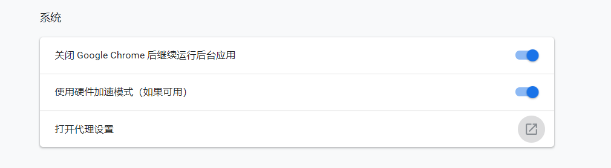
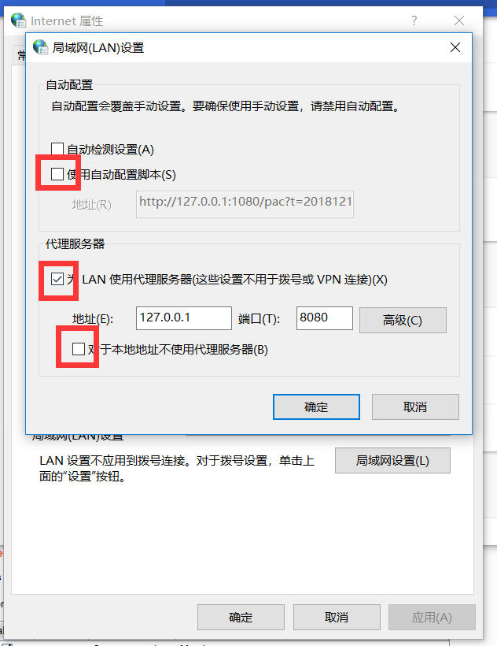
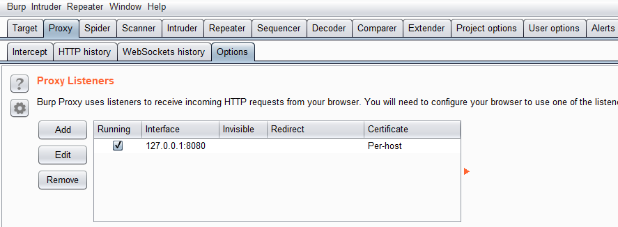
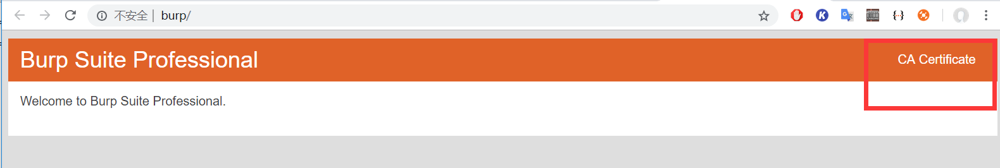
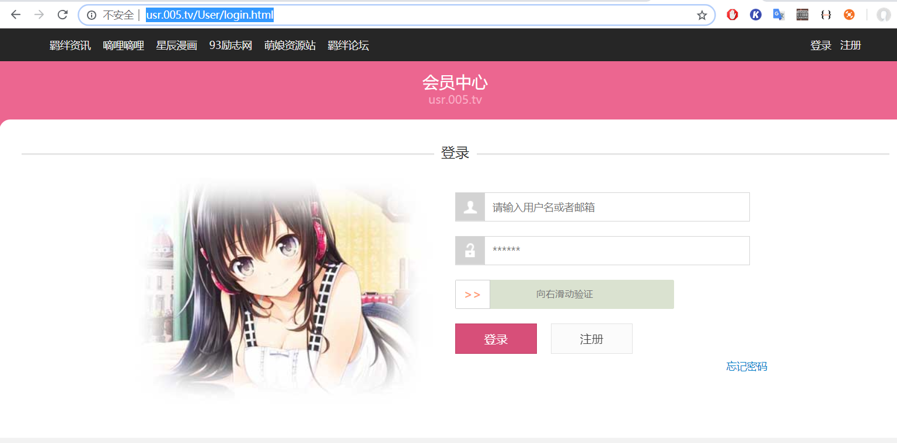
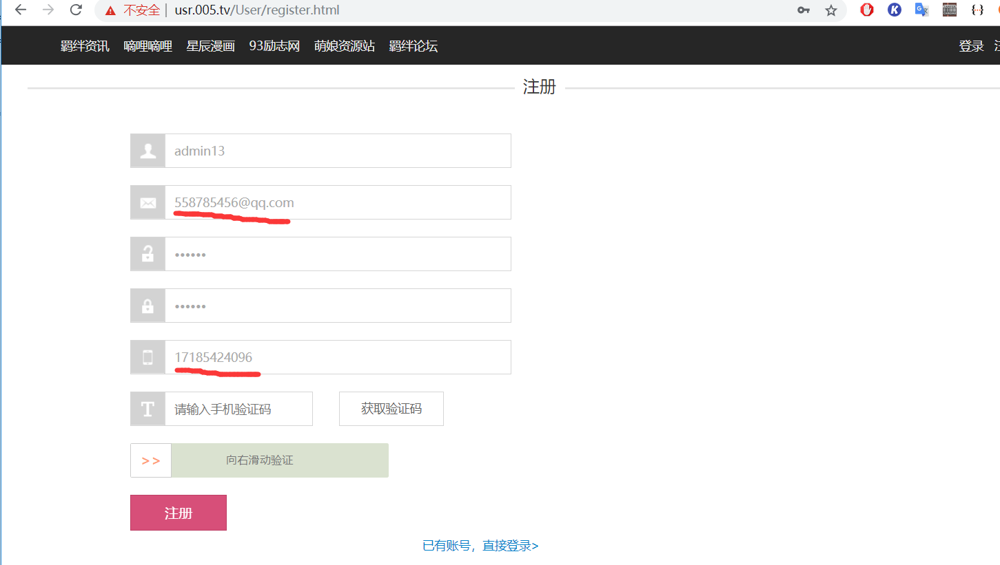
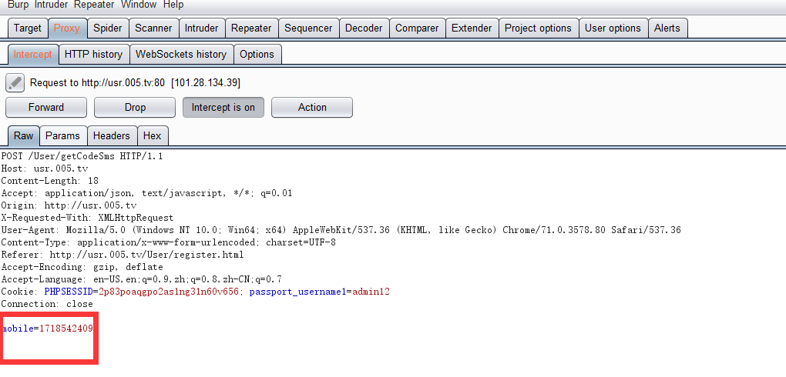
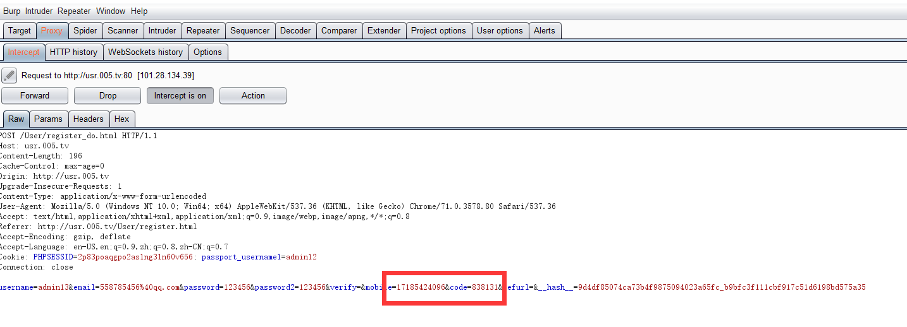

#### 1.配置
先配置浏览器代理，127.0.0.1：8080，使所有流量都要经过这 
  

  

再配置burpsuite监听这个端口的流量 
  

此外 ，因为要访问https,配置完这些后，打开浏览器访问http://burp，下载证书，安装到受信任颁发机构 

#### 实战
##### 1.第一个抓包小例子
1.先随意搜索后台登录页面,inurl:login.html,在这里我随机找了一个http://usr.005.tv/User/login.html

先点击注册

 
<strong>其中我们邮箱和手机号都是填的假号码。
然后开始拦截抓包，滑动滑块

修改号码为自己手机号，收到验证码

输入验证码

在这里发现，后端验证时，同时验证了发送验证码的手机号和验证码，所以验证失败，如果在这也修改为自己手机号，那注册时的假号码就无意义了。
#### 问题
1.使用burpsuite抓包后，vpn没用了，不能访问外网 

解决，虚拟机里使用burpsuite,nat模式连接，物理机还是挂了vpn
