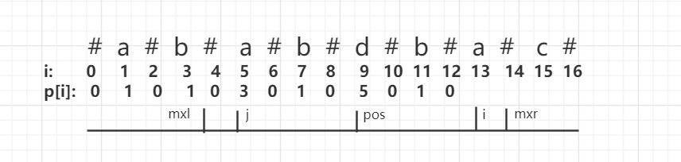

### manacher算法
处理回文字符串:<br>
一搬思路为中心拓展:<br>
```
//预处理，得到不分奇偶的新串 #a#b#a#c#
for(int i=0; i<len; i++){
  for (int j = 0; (i-j >= 0) && (i+j < len); j++){
		  //在左右j距离拓展匹配
      if (s[i - j] != s[i + j])
				break;
      //纪录最大距离
	}
  //更新最大子串

}
```
Manacher算法，将时间压缩到线性，时间复杂度/空间复杂度都是O(n).


##### 1.新串
无论字符串原先为奇数还是偶数长度，通过添加特殊字符都能使之变为奇数，减少判断条件。<br>
例:
- aba >> #a#b#a#
- abab >> #a#b#a#b#

##### 2.循环得到p[i]
首先定义几个变量: <br>
- p[i] 存储对应位置(i)的最大子串的长度,左或右半边(包括了自己本身)
- pos 当前最大子串的中心位置
- mxr 当前最大子串的右边界
- mxl 当前最大字串的左边界


manacher算法的关键: <br>
//p[i] = mxr > i ? Math.min(p[2*pos -i], mxr-i):1;<br>
<strong>p[i] = mxr > i ? Math.min(p[2pos -i], mxr-i):0;</strong>  

如图，i和j关于pos对称，pos-j = i-pos， 即 j = 2*pos-i<br>
当要计算第i位的p[i]时，i位之前的p[i]都为已知：<br>
此时:<br>
###### (1).若i在mxr右边
将p[i]置为1(因为mxr的位置必定为#,它的下一位肯定>=1,但是如果mxr==i,则为p[i]肯定为0，所以这里置为0)，进行拓展匹配。<br>
###### (2).若i在当前最大字串范围内：<br>
<strong>mxr-i 与 p[j] 的关系，判断以 j 为中心的子串是否完全在以pos为中心的子串内.<br></strong>
- 若 mxr - i > p[j]\(例p[10]，p[11],p[12]), 此时可知已j为中心的回文串，包含在以pos为中心的回文串左边部分内，由左右对称可知，以i为中心的回文串p[i] = p[j]<br>
- 若 mxr -i <= p[j]\(例p[13]), 此时mxr-i和j-mxl部分是一样的，可以保证如果原理这部分关于j对称的话(又因为mxr-i<=p[j],所以这部分肯定对称，j-mxl是j的字串的一部分)，至少这部分关于i肯定对称，所以p[i]至少有mxr-i的长度,再向右进行拓展匹配<br>

取p[j]和mxr-i中较小的值，再进行拓展匹配<br>

这样循环一次就得到了所有p[i]的值。

##### 3.具体代码
```
class Solution {
    public String longestPalindrome(String s) {
        //生成新串
        StringBuffer sb = new StringBuffer();
        for(int i=0; i<s.length()*2+1; i++){
            if(i%2 == 0){
                sb.append("#");
            }else{
                sb.append(s.charAt(i/2));
            }
        }
        String ns = sb.toString();
        //处理
        int[] p = new int[ns.length()];
        p[0] = 0;
        int pos = 0, mxr = 0;
        for(int i=0; i<ns.length(); i++){
            p[i] = mxr>i ? Math.min(p[pos*2-i],mxr-i):0;
            //继续进行拓展
            //是否到达左边界，是否到达右边界，是否对称
            while(i-p[i] >=0
                 && i+p[i]<= ns.length()-1
                 && ns.charAt(i+p[i]) == ns.charAt(i-p[i])){
                p[i]+=1;
            }
            //发现更大的子串，进行调整，如果相等，不调整，取第一个
            if(p[i]> mxr-pos){
                pos = i;
                mxr = p[i] + i;
            }
        }
        //因为p[pos]的长度包括了pos自己,所以回文串范围为(pos-p[pos]+1, pos+p[pos]-1)
        //因为substring取值为[a,b)，所以范围为(pos-p[pos]+1, pos+p[pos])
         return ns.substring(pos-p[pos]+1, pos+p[pos]).replace("#","");
    }
}
```
