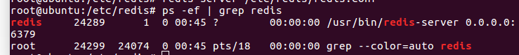
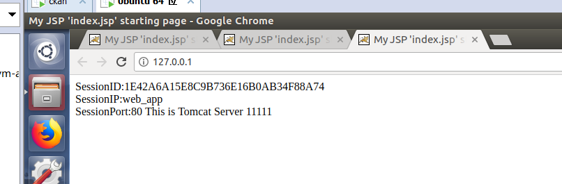
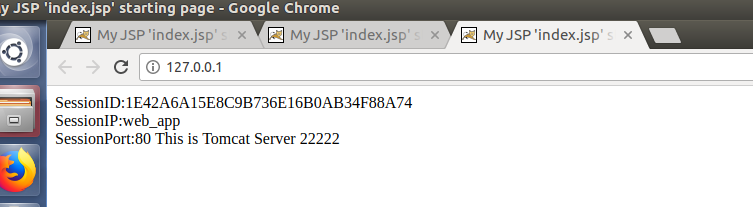

#### 1.需求
不同Ip主机上的tomcat,保持session同步。<br>
#### 2.查资料
一般做法为，利用redis保持session,不同tomcat从redis存取，外层nginx做tomcat的负载均衡。<br>
开源项目https://github.com/jcoleman/tomcat-redis-session-manager， 提供了tomcat连接redis的jar包，但是，我试了多次，总是不行，版本不对，或者class找不到等。<br>
解决方案参照：https://my.oschina.net/Listening/blog/674759, 直接用gradle生成jar包。

#### 3.实现
tomcat7.0.61/nginx1.10.3/ubuntu虚拟机
###### 1.tomcat
- 解压两个tomcat到两个虚拟机
- conf/server.xml更改端口，使之不重复
- 添加index.jsp到 webapps/Root目录下
- 分别启动tomcat,看看是否正常
```
<%@ page language="java" import="java.util.*" pageEncoding="UTF-8"%>  
<%  
String path = request.getContextPath();  
String basePath = request.getScheme()+"://"+request.getServerName()+":"+request.getServerPort()+path+"/";  
%>  
<!DOCTYPE HTML PUBLIC "-//W3C//DTD HTML 4.01 Transitional//EN">  
<html>  
  <head>  
    <base href="<%=basePath%>">  
    <title>My JSP 'index.jsp' starting page</title>  
    <meta http-equiv="pragma" content="no-cache">  
    <meta http-equiv="cache-control" content="no-cache">  
    <meta http-equiv="expires" content="0">      
    <meta http-equiv="keywords" content="keyword1,keyword2,keyword3">  
    <meta http-equiv="description" content="This is my page">  
    <!--
    <link rel="stylesheet" type="text/css" href="styles.css">
    -->  
  </head>  
  <body>  
        SessionID:<%=session.getId()%>  
        <BR>  
        SessionIP:<%=request.getServerName()%>  
        <BR>  
        SessionPort:<%=request.getServerPort()%>  
        <%  
        out.println("This is Tomcat Server 22222");  
        %>  
  </body>  
</html>
```

###### 2.nginx
编辑/etc/nginx/nginx.conf 添加tomcat配置
```
user www-data;
worker_processes auto;
pid /run/nginx.pid;

events {
	worker_connections 768;
	# multi_accept on;
}

http {
 .......
	include /etc/nginx/conf.d/*.conf;
	include /etc/nginx/sites-enabled/*;

upstream tomcat{
	#ip_hash;
	server   192.168.93.132:8081	weight=1;
	server   192.168.93.133:8080	weight=1;
	}
server{
	listen 80;
	server_name localhost 127.0.0.1;
            location / {
                root    html;
                index   index.jsp;
                proxy_pass      http://tomcat;
                proxy_set_header        X-Real-IP       $remote_addr;
                client_max_body_size    100m;
            }
	}
}
........
}
```

###### 3.redis
这一步很坑，参照：https://my.oschina.net/Listening/blog/674759, 进行配置<br>

将生成的jar包全部放入tomcat/lib/目录下<br>
编辑tomcat/conf/content.xml文件,添加
```
<Context>
    ........
    <!--
    <Valve className="org.apache.catalina.valves.CometConnectionManagerValve" />
    -->
<Valve className="com.orangefunction.tomcat.redissessions.RedisSessionHandlerValve" />
<Manager className="com.orangefunction.tomcat.redissessions.RedisSessionManager"
    host="127.0.0.1" //注意这里，应该是redis地址
    port="6379"
    database="0"
    maxInactiveInterval="60"
/>

</Context>
```
在这里可能会出现redis连接不上问题，原因是/etc/redis/redis.conf 文件里默认配置为 bind 127.0.0.1, 改为 0.0.0.0<br>
除此之外也有可能防火墙原因.<br>
重启 redis-server /etc/redis/redis.conf <br>
查看是否监听0.0.0.0:6379端口 ps -ef | grep redis



#### 4. 重启tomcat 查看效果



可以看到现在session已经保持不变


#### 5.2018-12-26补充
公司项目是用的tomcat6部署，所以直接用上面打包好的jar包会报:java.lang.AbstractMethodError错误，意思是jar包冲突。<br>
解决办法:<br>
去github上下载tomcat6的分支，重新打包,将dist目录下所有jar包和bulid/lib目录下的tomcat-redis-session-XXXX.jar放到tomcat的lib目录下<br>
```
apply plugin: 'java'
apply plugin: 'maven'
apply plugin: 'signing'

group = 'com.orangefunction'
version = '1.2.0'

repositories {
  mavenCentral()
}

compileJava {
  sourceCompatibility = 1.7
  targetCompatibility = 1.7
}

dependencies {
  //compile group: 'org.apache.tomcat', name: 'tomcat-catalina',
   version: '6.0.37'
  //用tomcat6.0.37的jar打包
  compile fileTree(dir: 'pathto/your/tomcat6.0.37/lib', include: ['*.jar'])
  compile group: 'redis.clients', name: 'jedis', version: '2.5.2'
  compile group: 'org.apache.commons', name: 'commons-pool2', version: '2.2'

  testCompile group: 'junit', name: 'junit', version: '4.+'
  testCompile 'org.hamcrest:hamcrest-core:1.3'
  testCompile 'org.hamcrest:hamcrest-library:1.3'
  testCompile 'org.mockito:mockito-all:1.9.5'
  testCompile group: 'org.apache.tomcat', name: 'tomcat-coyote', version: '6.0.37'
}

task javadocJar(type: Jar, dependsOn: javadoc) {
  classifier = 'javadoc'
  from 'build/docs/javadoc'
}

task sourcesJar(type: Jar) {
  from sourceSets.main.allSource
  classifier = 'sources'
}

artifacts {
  archives jar

  archives javadocJar
  archives sourcesJar
}

task copyJars(type: Copy) {
  from configurations.runtime
  into 'dist'  
}

uploadArchives {
  repositories {
    mavenDeployer {
      beforeDeployment { MavenDeployment deployment -> signing.signPom(deployment) }


      pom.project {
        name 'tomcat-redis-session-manager'
        packaging 'jar'
        description 'Tomcat Redis Session Manager is a Tomcat extension to store sessions in Redis'
        url 'https://github.com/jcoleman/tomcat-redis-session-manager'

        issueManagement {
          url 'https://github.com:jcoleman/tomcat-redis-session-manager/issues'
          system 'GitHub Issues'
        }

        scm {
          url 'https://github.com:jcoleman/tomcat-redis-session-manager'
          connection 'scm:git:git://github.com/jcoleman/tomcat-redis-session-manager.git'
          developerConnection 'scm:git:git@github.com:jcoleman/tomcat-redis-session-manager.git'
        }

        licenses {
          license {
            name 'MIT'
            url 'http://opensource.org/licenses/MIT'
            distribution 'repo'
          }
        }

      }
    }
  }
}
```
tomcat6版本在部署时，className名字和tomcat7版本不一样
```
<Valve className="com.radiadesign.catalina.session.RedisSessionHandlerValve" />
<Manager className="com.radiadesign.catalina.session.RedisSessionManager"
         host="localhost" <!-- optional: defaults to "localhost" -->
         port="6379" <!-- optional: defaults to "6379" -->
         database="0" <!-- optional: defaults to "0" -->
         maxInactiveInterval="60" <!-- optional: defaults to "60" (in seconds) --> />
```

如果还报configure XXX.xml错误<br>
到tomcat/conf/Catalina/localhost目录下，只保留你的项目.xml
