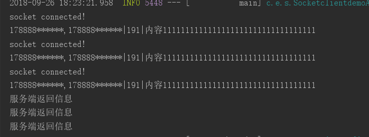
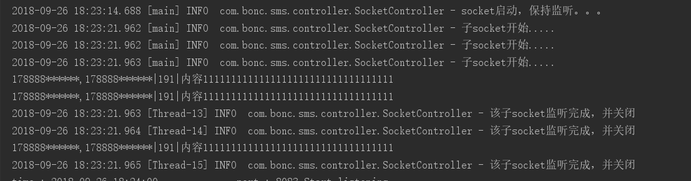

#### 1.java.net.socket
server端代码，使用子线程处理连接
```
@Controller
public class SocketController {
    private final static Log logger = LogFactory.getLog(SocketController.class);

    public void accept(){
        try{
            ServerSocket socketServer = new ServerSocket(8888);
            logger.info("socket启动，保持监听。。。");
            //保持监听,同时连接多个
            while (true){
                Socket socket = socketServer.accept();
                logger.info("子socket开始.....");
                new DispatchRequestThread(socket).start();
            }
        }catch (Exception e){
            e.printStackTrace();
        }
    }

    /**
     * 处理socket线程类
     */
    class DispatchRequestThread extends Thread {

        BufferedReader in;
        PrintWriter out;
        Socket socket;

        public DispatchRequestThread(Socket socket) {
            this.socket = socket;
        }

        @Override
        public void run() {
            try {
                //通过socket输入流，读取客户端发来的数据
                in = new BufferedReader(new InputStreamReader(socket.getInputStream()));
                //通过socket输出流，给客户端发送回执
                out = new PrintWriter(socket.getOutputStream(), true);

                //获取input
                String line = "";
               // line = in.readLine(); //其实就只有一行数据
               while (true){
                   if(in.ready()){
                       line = in.readLine();
                       System.out.println(line);
                       break;
                   }
               }
                socket.shutdownInput();

               //返回
                String result = vaildCkeck(line);
                out.write(result);

                //关闭socket
                out.flush();
                in.close();
                out.close();
                logger.info("该子socket监听完成，并关闭");
            } catch (IOException e) {
                e.printStackTrace();
            } finally {
                //
            }
        }
    }

    /**
     * 输入校验，返回定义错误类型
     * @param line
     * @return
     */
    public String vaildCkeck(String line) {
      //.....
        }
    }
}

```

client代码，创建三个socket连接
```

public class MsgTest {

  public void send() throws Exception,SGIP_Exception {
      //简单创建三个连接
      Thread t1 = new SocketClientThread();
      Thread t2 = new SocketClientThread();
      Thread t3 = new SocketClientThread();
      t1.join();
      t2.join();
      t3.join();
      t1.start();
      t2.start();
      t3.start();
  }

  //socket
  class SocketClientThread extends  Thread{
      @Override
      public void run(){
          Socket socket = null;
          BufferedReader in = null;
          PrintWriter out = null;

          //可以同时发送1-100个号码
          String str1 = "178888******,178888******";
          String str2 = "191";
          String str3 = "内容1111111111111111111111111111111111";
          String str = str1 +"|" + str2 + "|" + str3;

          //建立连接
          try {
              socket = new Socket("127.0.0.1", 8888);
              socket.setSoTimeout(10000);
              System.out.println("socket connected!");
              out = new PrintWriter(socket.getOutputStream());
              in = new BufferedReader(new InputStreamReader(socket.getInputStream()));
              //发送消息
              out.write(str);
              out.flush();
              socket.shutdownOutput();
              //得到回执
              System.out.println(in.readLine());
              //关闭连接
              in.close();
              out.close();
              socket.close();
          }catch (Exception e){
              e.printStackTrace();
          }
      }
  }

}

```
运行截图





#### 2.nio

#### 3.netty
