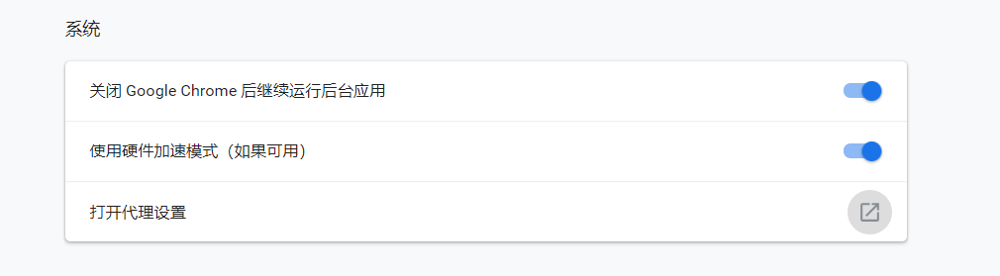
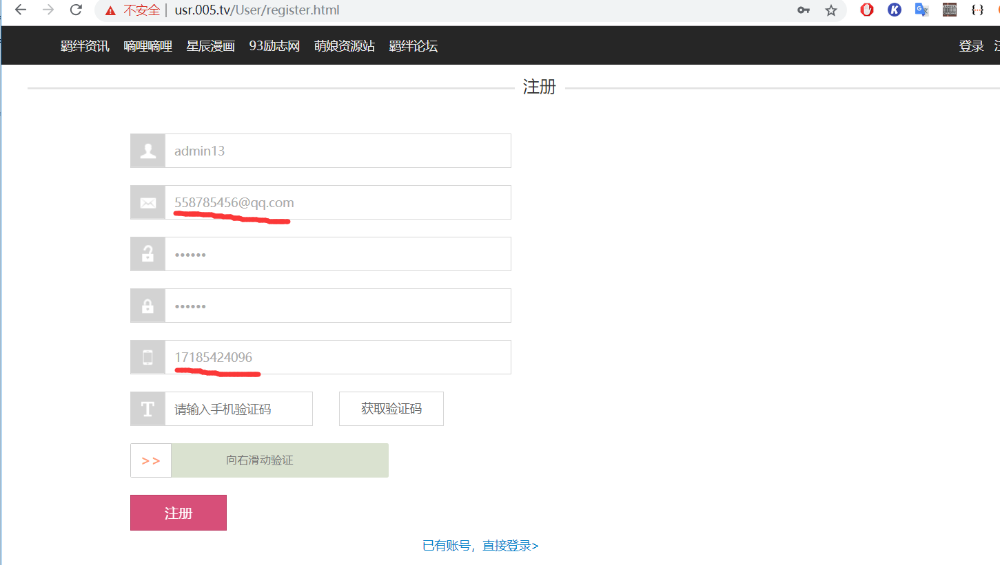
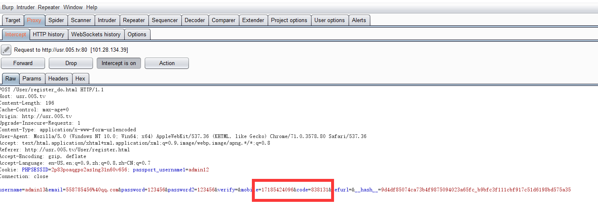

#### 1.配置
先配置浏览器代理，127.0.0.1：8080，使所有流量都要经过这 
  

  

再配置burpsuite监听这个端口的流量 
  

此外 ，因为要访问https,配置完这些后，打开浏览器访问http://burp，下载证书，安装到受信任颁发机构 

#### 实战
##### 1.第一个抓包小例子
1.先随意搜索后台登录页面,inurl:login.html,在这里我随机找了一个http://usr.005.tv/User/login.html

先点击注册

 
<strong>其中我们邮箱和手机号都是填的假号码。
然后开始拦截抓包，滑动滑块

修改号码为自己手机号，收到验证码

输入验证码

在这里发现，后端验证时，同时验证了发送验证码的手机号和验证码，所以验证失败，如果在这也修改为自己手机号，那注册时的假号码就无意义了。

##### 2.一个爆破小例子
来dvwn的登录（admin/password）

随便输入，抓取数据包，send to intruder

选择Cluster模式，可以使用同的字典，进行穷举（笛卡尔积） 
然后，clear清空变量，鼠标选中后，add添加自己需要的变量

分别添加变量对应的字典，进行爆破

爆破完成后，点击length，查看length长度(正确的和错误的length长度会不样)

#### 问题
1.使用burpsuite抓包后，vpn没用了，不能访问外网 

解决1，虚拟机里使用burpsuite,nat模式连接，物理机还是挂了vpn 

2018/12/20 添加: 
解决2，使用代理链 https://www.anquanke.com/post/id/85925 
同理，也可以使用代理链来用tor进行代理(防封ip)

不稳定，容易出错：SOCKS server general failure 
原因待查。。。

#### 3.返回包修改与抓手机包
###### 3.1修改返回包

点击拦截后, forward会将返回结果拦截，然后自己进行修改。 
再次点击forward将修改完的数据返回给原请求。
###### 3.2抓取手机http流量
https需要配置证书，其它一样。 
手机和burp在同一局域网下 

配置burp监听本机ip,端口随意 
到手机设置里面，对连接的wifi进行修改。选择连接的wifi->显示高级选项->选择代理(手动)->
配置ip和端口(上一步burp中设置的)->ip(DHCP)。 
现在可以到burp中进行抓包了 
