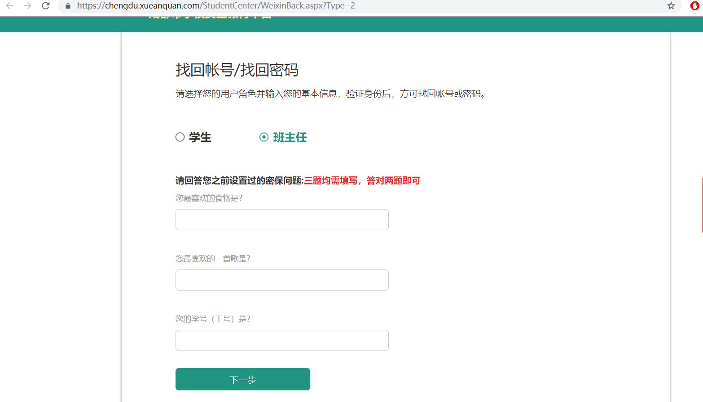

### 1.起因
今天暂时写完了手上的后端接口，有点时间，想起前几天看见女朋友用的安全教育平台有个密码找回功能。 
喜闻乐见，大家都知道这是个漏洞高发区。刚好去年看过几篇这方面的文章，一直没实践过，今天刚好练习下（我是未入门菜鸟）。
### 2.具体过程
登录页面 
看见这个已运行800天，心里就是一动，多半会成功了。

密码找回页面 
在这一步需要填一些信息 
首先你要知道自己要改谁的密码，所以这一步的信息默认自己已知

密码找回页面2 
要求在这里输入密保信息进行验证 
由于不知道信息，所以想办法绕过 
首先查看网页源代码，看看有没有逻辑漏洞 

源代码 
可以看到这里直接通过判断返回值中Result（boolean）来确定有没有验证成功，没有其它限制 
所以首先想到通过拦截返回包，修改返回值

返回包 
将返回包中Result改为true，再发回页面

新密码 
如图,成功跳转到修改密码界面 

实际修改密码时返回非法操作，观察发现需要传入一个DesSucuss字段，为48位hash,多次测试，该值不变 
所以猜测为固定字段hash,暂未找到hash方式
