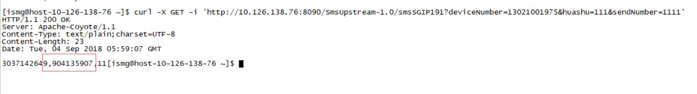
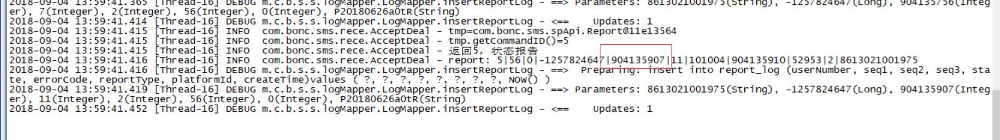

###### 问题:
在联通SGIP网关中，Submit发送消息后，怎么将返回的REPORT与之关联起来。

###### Submit内容
```
CommandId*	命令ID，十六进制数字
SequenceNumber	序列号，十六进制数字
SPNumber	SP的接入号码，字符
ChargeNumber	付费号码，字符，手机号码前加“86”国别标志；当且仅当群发且对用户收费时为空；如果为空，则该条短消息产生的费用由UserNumber代表的用户支付；如果为全零字符串“000000000000000000000”，表示该条短消息产生的费用由SP支付。
UserNumber	一个或多个接收该短消息的手机号，手机号之间用逗号(,)隔开，字符，手机号码前加“86”国别标志，如8613001125453,8613001132345
CorpId	企业代码，取值范围0-99999，字符
ServiceType	业务代码，由SP定义，字符
FeeType*	计费类型，字符
FeeValue	取值范围0-99999，该条短消息的收费值，单位为分，由SP定义，字符
对于包月制收费的用户，该值为月租费的值
GivenValue	取值范围0-99999，赠送用户的话费，单位为分，由SP定义，特指由SP向用户发送广告时的赠送话费，字符
AgentFlag	代收费标志，0：应收；1：实收，字符
MorelatetoMTFlag	引起MT消息的原因
0-MO点播引起的第一条MT消息；
1-MO点播引起的非第一条MT消息；
2-非MO点播引起的MT消息；
3-系统反馈引起的MT消息。
字符
Priority	优先级0-9从低到高，默认为0，十六进制数字
ExpireTime	短消息寿命的终止时间，如果为空，表示使用短消息中心的缺省值。时间内容为16个字符，格式为“yymmddhhmmsstnnp”，其中“tnnp”取固定值“032+”，即默认系统为北京时间
ScheduleTime	短消息定时发送的时间，如果为空，表示立刻发送该短消息。时间内容为16个字符，格式为“yymmddhhmmsstnnp”，其中“tnnp”取固定值“032+”，即默认系统为北京时间
ReportFlag	状态报告标记
0-该条消息只有最后出错时要返回状态报告
1-该条消息无论最后是否成功都要返回状态报告
2-该条消息不需要返回状态报告
3-该条消息仅携带包月计费信息，不下发给用户，要返回状态报告
其它-保留
缺省设置为0，十六进制数字
MessageType	信息类型：
0-短消息信息
其它：待定

十六进制数字
TP_pid	GSM协议类型。详细解释请参考GSM03.40中的9.2.3.9
十六进制数字
TP_udhi	GSM协议类型。详细解释请参考GSM03.40中的9.2.3.23,仅使用1位，右对齐
十六进制数字
MessageCoding	短消息的编码格式。
0：纯ASCII字符串
3：写卡操作
4：二进制编码
8：UCS2编码
15：GBK编码
其它参见GSM3.38第4节：SMS Data Coding Scheme
十六进制数字
MessageContent	短消息的内容，十六进制数字
Reserve	保留，扩展用
```
###### REPORT内容
```
CommandId	命令ID，十六进制数字
SequenceNumber	序列号，十六进制数字
SubmitSequenceNumber	该命令所涉及的Submit或deliver命令的序列号，十六进制数字
ReportType	Report命令类型
0：对先前一条Submit命令的状态报告
1：对先前一条前转Deliver命令的状态报告，十六进制数字
UserNumber	接收该短消息的手机号，字符，手机号码前加“86”国别标志
State*	该命令所涉及的短消息的当前执行状态
0：发送成功
1：等待发送
2：发送失败
十六进制数字
ErrorCode	当State=2时为错误码值，否则为0，十六进制数字
Reserve	保留，扩展用
```
###### 观察
  请求时，返回：
  
  后台输出REPORT:
  

  通过对比发现其中有某两个字段相同，ok,到这基本搞定。

###### 解决
1.在Submit时，将SequenceNumber存储
```
//将seq与spNumber存储 SequenceNumber为 seq1+seq2+seq3
SubmitReportMapEntity submitReportMapEntity = new SubmitReportMapEntity();
submitReportMapEntity.setSeq1(String.valueOf(submit.getSeqno_1()));
submitReportMapEntity.setSeq2(String.valueOf(submit.getSeqno_2()));
submitReportMapEntity.setSeq3(String.valueOf(submit.getSeqno_3()));
submitReportMapEntity.setSpNumber(String.valueOf(submit.getSPNumber()));
logService.storeSubmitReportMap(submitReportMapEntity);
```
2.Report时通过SequenceNumber获取SP(外显号)
```
String spNumber_temp = new String();
spNumber_temp = logService.submitReportMapInquiry(String.valueOf(report.getSeq_2()),String.valueOf(report.getSeq_3()));
```
